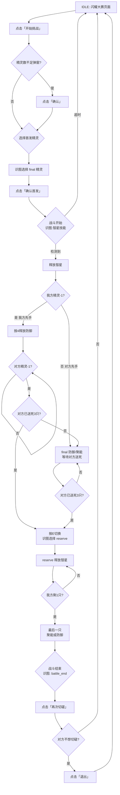

# 洛克王国游戏自动化 - 闪耀大赛刷金币

**版本**: v1.0
**日期**: 2026-04-03
**状态**: 已确认

---

## 1. 项目概述

### 1.1 目标
实现洛克王国 PC 客户端的闪耀大赛自动刷金币脚本，通过图像识别和后台模拟输入完成自动化战斗。

### 1.2 技术栈
- **语言**: Python 3.x
- **图像识别**: OpenCV 模板匹配 + EasyOCR
- **游戏控制**: win_util 库（后台鼠标/键盘模拟）
- **窗口**: 1920x1080 分辨率，后台运行
- **架构**: 状态机 + 配置驱动

---

## 2. 项目结构

```
roco-kingdom-script/
├── main.py                     # 程序入口
├── config/
│   ├── settings.json          # 全局设置（相似度、超时等）
│   └── elves.json             # 精灵配置
├── assets/
│   └── templates/             # 模板图像目录
│       ├── skills/            # 技能图标
│       │   ├── comet.png      # 彗星
│       │   ├── defense.png    # 防御
│       │   ├── energy.png     # 聚能
│       │   └── switch.png     # 切换精灵
│       ├── battle/            # 战斗状态
│       │   ├── battle_start.png     # 战斗开始（彗星出现）
│       │   ├── battle_end.png       # 战斗结束
│       │   ├── retry.png            # 再次切磋
│       │   └── quit.png             # 退出
│       ├── dots/              # 精灵生命指示器
│       │   ├── dot_active.png     # 亮着的小圆点
│       │   └── dot_inactive.png   # 熄灭的小圆点
│       ├── elves/             # 精灵头像
│       │   ├── elf_1.png
│       │   ├── elf_2.png
│       │   ├── elf_3.png
│       │   └── elf_4.png
│       └── popup/             # 弹窗
│           └── insufficient.png    # 精灵数不足
├── src/
│   ├── __init__.py
│   ├── controller.py          # 游戏控制器
│   ├── state_machine.py       # 状态机
│   ├── battle_flow.py         # 战斗流程
│   ├── elf_manager.py         # 精灵管理器
│   ├── skill_executor.py      # 技能执行器
│   └── logger.py             # 日志模块
├── logs/                      # 日志目录
├── docs/
│   └── specs/                 # 设计文档
└── run.bat                    # 运行脚本
```

---

## 3. 配置文件

### 3.1 全局设置 `config/settings.json`

```json
{
  "similarity": 0.8,
  "timeouts": {
    "battle_start": 10,
    "skill_cast": 5,
    "switch_elf": 3,
    "battle_end": 10
  },
  "loop_count": 10,
  "screenshot_debug": "on_failure",
  "log_level": "DEBUG",
  "window": {
    "class_name": "UnrealWindow",
    "title": "洛克王国：世界"
  }
}
```

| 字段 | 说明 |
|-----|------|
| `similarity` | 默认图像匹配相似度阈值 |
| `timeouts.*` | 各操作的超时时间（秒） |
| `loop_count` | 循环执行次数 |
| `screenshot_debug` | 调试截图策略：`on_failure`=仅失败 / `always`=始终 / `off`=关闭 |
| `log_level` | 日志级别：`DEBUG` / `INFO` / `WARNING`，默认 DEBUG |
| `window.class_name` | 窗口类名：`UnrealWindow` |
| `window.title` | 窗口标题：`洛克王国：世界` |

### 3.2 精灵配置 `config/elves.json`

```json
{
  "elves": [
    {"name": "精灵A", "template": "elves/elf_1.png", "role": "sacrifice"},
    {"name": "精灵B", "template": "elves/elf_2.png", "role": "sacrifice"},
    {"name": "精灵C", "template": "elves/elf_3.png", "role": "final"},
    {"name": "精灵D", "template": "elves/elf_4.png", "role": "reserve"}
  ],
  "final_action": "energy"
}
```

| 字段 | 说明 |
|-----|------|
| `elves[].name` | 精灵名称 |
| `elves[].template` | 精灵头像模板图像路径（唯一标识） |
| `elves[].role` | 角色：`sacrifice`=送死 / `final`=最后送死 / `reserve`=备用（速度慢时替代final） |
| `final_action` | 最后精灵动作：`energy`=聚能 / `defense`=防御 |

**角色说明：**
- `final` — 最后的精灵，整场战斗最后送死
- `sacrifice` — 送死精灵，按顺序送死
- `reserve` — 备用精灵，**速度慢时替代 final 提前送死** |

---

## 4. 战斗机制

### 4.1 闪耀大赛规则
- **参战数量**: 双方各 4 只精灵 = 4 条命
- **胜负条件**: 对方 4 只精灵全部阵亡
- **奖励**: 金币（根据名次）

### 4.2 精灵数量检测
- **方式**: 识别血条下方的小圆点
- **模板**: `dot_active.png`（亮）/ `dot_inactive.png`（灭）
- **计算**: 亮着的圆点数 = 当前存活精灵数

### 4.3 速度与先后手
- 游戏根据精灵速度属性自动决定先后手
- 每局先后手不固定，需要运行时检测

### 4.4 技能操作
| 操作 | 方式 |
|-----|------|
| 彗星 | 识图点击技能栏 |
| 防御 | 识图点击技能栏 |
| 聚能 | 按键盘 `X` |
| 更换精灵 | 按键盘 `E` → 弹出精灵列表 → 识图点击选择 |

### 4.5 精灵角色与送死顺序

**角色定义：**
- `final` — 最后的精灵，整场战斗最后送死
- `sacrifice` — 送死精灵，按顺序送死
- `reserve` — 备用精灵，速度慢时替代 final 提前送死

**速度优先（我方先手）时的送死顺序：**
```
第1只 → final
第2只 → sacrifice_1
第3只 → sacrifice_2
最后只 → reserve（防御/聚能）
```

**速度劣势（对方先手）时的送死顺序：**
```
第1回合 → final（防御/聚能，让对方先送）
对方送死3只后切换：
第4只 → reserve
第5只 → sacrifice_1
第6只 → sacrifice_2
第7只 → final
```

**重要：精灵的 template 图像才是唯一标识，配置顺序可随意替换。**

---

## 5. 状态机设计

### 5.1 状态定义

```python
class BattleState(Enum):
    IDLE = "idle"                      # 等待开始
    START_CHALLENGE = "start_challenge"# 点击开始挑战
    CHECK_INSUFFICIENT = "check_insufficient"  # 检查弹窗
    SELECT_FIRST = "select_first"      # 选择首发精灵
    CONFIRM_FIRST = "confirm_first"    # 确认首发
    BATTLE_START = "battle_start"      # 等待战斗开始
    SPEED_CHECK = "speed_check"       # 检测速度优势
    SACRIFICE_PHASE = "sacrifice_phase"  # 送死阶段
    FINAL_PHASE = "final_phase"       # 最后精灵阶段
    SWITCH_ELF = "switch_elf"         # 切换精灵
    BATTLE_END = "battle_end"         # 战斗结束
    RETRY = "retry"                   # 再次切磋
    QUIT = "quit"                     # 退出
    ERROR = "error"                   # 异常状态
```

### 5.2 战斗流程图



---

## 6. 核心模块

### 6.1 GameController (`src/controller.py`)

```python
class GameController:
    def __init__(self, hwnd: int):
        self.win = WinController(hwnd=hwnd)
        self.screenshot_cache = None

    def capture(self):           # 更新截图缓存
    def find_skill(name):       # 识图查找技能位置
    def click_skill(name):      # 点击技能
    def press_key(key):         # 按键
    def find_and_click(image):  # 找图并点击
    def wait_for_image(image, timeout):  # 等待图像出现
```

### 6.2 ElfManager (`src/elf_manager.py`)

```python
class ElfManager:
    def __init__(self, config_path: str, controller: GameController):
        self.elves = []  # 加载配置
        self.controller = controller

    def load_config(self, config_path: str):  # 加载 elves.json
    def count_alive_elves(self) -> int:     # 识图统计存活精灵数
    def find_elf_position(self, elf_id) -> tuple:  # 识图定位精灵
    def get_sacrifice_order(self) -> list:   # 获取送死顺序
    def get_final_elf(self) -> dict:        # 获取最后精灵
```

### 6.3 SkillExecutor (`src/skill_executor.py`)

```python
class SkillExecutor:
    def __init__(self, controller: GameController, templates: dict):
        self.ctrl = controller
        self.templates = templates

    def cast_skill(self, skill_name: str):   # 释放技能（彗星/防御）
    def press_energy(self):                  # 聚能（按X）
    def switch_to_elf(self, elf_id: int):    # 切换到指定精灵
```

### 6.4 BattleFlow (`src/battle_flow.py`)

```python
class BattleFlow:
    def __init__(self, controller: GameController, elf_manager: ElfManager):
        self.ctrl = controller
        self.elf_mgr = elf_manager
        self.state = BattleState.IDLE

    def run_once(self) -> bool:              # 执行一轮战斗
    def detect_speed_advantage(self) -> bool: # 检测速度优势
    def sacrifice_loop(self, count: int):    # 送死循环
    def final_phase(self, action: str):     # 最后精灵阶段
```

### 6.5 StateMachine (`src/state_machine.py`)

```python
class BattleStateMachine:
    def __init__(self, battle_flow: BattleFlow):
        self.state = BattleState.IDLE
        self.flow = battle_flow

    def transition(self, new_state: BattleState):  # 状态切换
    def run(self, loop_count: int):               # 运行主循环
    def handle_error(self, error):                # 错误处理
```

---

## 7. 异常处理

| 异常情况 | 处理策略 |
|---------|---------|
| 游戏窗口关闭 | 停止脚本，输出日志 |
| 识图超时 | 进入 ERROR 状态，等待用户干预 |
| 精灵数不足弹窗 | 自动点击确认 |
| 对方不想切磋 | 点击退出，返回 IDLE |
| 其他异常 | 记录日志，尝试恢复或停止 |

---

## 8. 需要准备的识图资源

| 分类 | 文件名 | 说明 |
|-----|-------|------|
| 技能 | `comet.png` | 彗星技能图标 |
| 技能 | `defense.png` | 防御技能图标 |
| 战斗 | `battle_start.png` | 战斗开始标志（彗星出现） |
| 战斗 | `battle_end.png` | 战斗结束标志 |
| 战斗 | `retry.png` | 再次切磋按钮 |
| 战斗 | `quit.png` | 退出按钮 |
| 弹窗 | `insufficient.png` | 精灵数不足弹窗 |
| 弹窗 | `confirm.png` | 确认按钮（通用） |
| 选择 | `select_first.png` | 选择首发精灵界面 |
| 切换 | `switch_panel.png` | 切换精灵面板 |
| 精灵 | `elf_1.png` ~ `elf_4.png` | 各精灵头像（由 template 字段引用） |
| 生命点 | `dot_active.png` | 亮着的小圆点 |
| 生命点 | `dot_inactive.png` | 熄灭的小圆点 |

---

## 9. 扩展性设计

```
当前：闪耀大赛刷金币
  │
  ├── 新功能模块（按需添加）
  │   ├── 自动捉宠
  │   ├── 刷副本
  │   ├── 每日任务
  │   └── PVP 对战
  │
  └── 可配置化
      ├── 新战斗流程 → 修改 battle_flow.py
      ├── 新精灵配置 → 修改 elves.json
      └── 新技能 → 添加模板 + 修改 skill_executor.py
```

---

## 10. 待确认事项

- [x] 游戏窗口句柄获取方式：使用 `win32gui.FindWindow`
  - 类名：`UnrealWindow`
  - 标题：`洛克王国：世界`
- [x] 日志详细程度：`DEBUG`，要求可调（通过配置文件）
- [x] 调试截图保存策略：仅失败时保存

```python
def find_window(title_part: str = "洛克王国：世界") -> int:
    """查找游戏窗口"""
    hwnd = win32gui.FindWindow("UnrealWindow", title_part)
    if not hwnd:
        logger.error("未找到游戏窗口")
        raise Exception("未找到游戏窗口")
    return hwnd
```

---

**文档状态**: 所有待确认事项已完成
**下一步**: 编写 implementation plan
